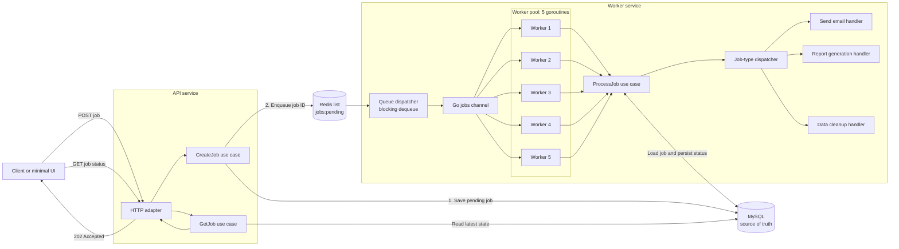
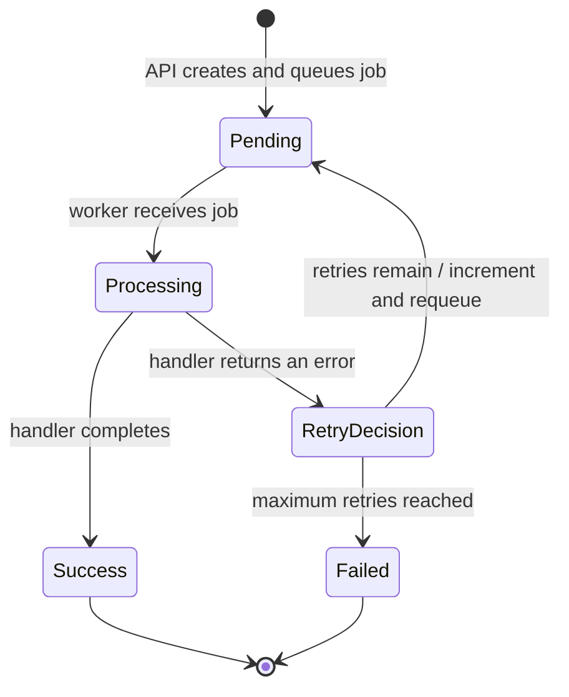

# Asynchronous Job Processing POC

## Description

This project is a learning-focused proof of concept for asynchronous backend job processing, implemented in Go using Clean Architecture.

Long-running or failure-prone work should not keep an HTTP request open. Instead, the API validates and persists a job, publishes its identifier to Redis, and immediately returns control to the client. A separate worker service consumes queued jobs, processes them concurrently, records every lifecycle change in MySQL, and retries recoverable failures.

The POC supports three representative background operations:

- `send_email`
- `report_generation`
- `data_cleanup`

The operations are intentionally lightweight simulations. The focus is the surrounding asynchronous workflow: queueing, concurrent execution, state management, retries, persistence, observability, and containerized operation.

This is an educational implementation of the underlying pattern, not a replacement for production systems such as RabbitMQ, Kafka, Redis Streams, or established distributed task frameworks.

## POC capabilities

The completed POC demonstrates the following Definition of Done outcomes:

| Capability | Expected outcome |
|---|---|
| Job submission | The API accepts valid jobs for all three supported types. |
| Queue-based handoff | New jobs are persisted as `pending`, then their IDs are pushed to a Redis list. |
| Asynchronous consumption | A dedicated worker service blocks on Redis and processes jobs outside the API request. |
| Concurrent processing | A channel-based pool of five worker goroutines processes independent jobs concurrently. |
| Lifecycle tracking | Jobs transition through `pending`, `processing`, and either `success` or `failed`. |
| Retry handling | Failed attempts are retried up to three times before the job becomes terminally failed. |
| Durable job status | MySQL stores the payload, status, retry information, errors, and lifecycle timestamps. |
| Status lookup | Clients can query the latest persisted job state through the API. |
| Supported operations | Email delivery, report generation, and data cleanup are represented by separate handlers. |
| Observability | Structured logs identify queueing, dequeueing, processing, retries, success, and failure. |
| Local operation | The API, worker, MySQL, Redis, and database migrations run through Docker Compose. |
| Submission interface | An API endpoint and minimal UI provide job submission and status checking. |

## Architecture

The project follows Clean Architecture. Domain rules and application use cases remain independent of HTTP, GORM, MySQL, Redis, Docker, and concrete job handlers. Infrastructure details implement interfaces defined toward the center of the application and are connected only in the executable composition roots.

```text
Driving adapters → application ports and use cases → domain
Infrastructure adapters ────────────────────────────┘
```

### End-to-end processing flow



MySQL holds the complete job and remains the source of truth. Redis contains only job IDs, keeping queue messages small and ensuring the worker always loads the latest persisted state before processing.

The API persists a job before enqueueing it. Consequently, a worker cannot receive an ID for a job that has not yet been committed to MySQL.

### Processing outcomes and retry flow



A job receives one initial processing attempt and up to three retry attempts. A successful retry ends in `success`; repeated failure ends in `failed`, with the last error and completion time persisted for status queries and troubleshooting.

### Runtime responsibilities

| Component | Responsibility |
|---|---|
| API | Validate requests, create jobs, enqueue IDs, and return persisted status. |
| MySQL | Store the authoritative job record and its complete lifecycle. |
| Redis | Buffer pending job IDs between the API and worker service. |
| Queue dispatcher | Block until work is available and feed IDs into the internal jobs channel. |
| Worker pool | Run five independent job-processing goroutines. |
| `ProcessJob` | Coordinate loading, state transitions, execution, retries, and persistence. |
| Job-type dispatcher | Select the handler matching the persisted job type. |
| Job handlers | Perform the simulated email, report, or cleanup operation. |

## Project structure

## Prerequisites

- Go `1.24.10` or the version declared in `go.mod`.
- Docker Engine or Docker Desktop.
- Docker Compose.
- `curl` for command-line API checks.
- `make` for the provided developer commands.

The Makefile defaults to the standalone `docker-compose` command. If your environment provides the Docker Compose plugin instead, pass it explicitly:

```bash
make COMPOSE="docker compose" up
```

## Quick start

Create the local configuration file:

```bash
cp .env.example .env
```

Replace the example database passwords in `.env`, then build and start the complete stack:

```bash
make up
```

Check the container states:

```bash
make ps
```

The API, worker, MySQL, and Redis should be running. The migration container is expected to finish successfully and exit with status code `0`.

Check API liveness and infrastructure readiness:

```bash
curl -i http://localhost:8080/health/live
curl -i http://localhost:8080/health/ready
```

Expected response bodies:

```json
{"status":"ok"}
```

```json
{"status":"ready"}
```

Follow the worker lifecycle logs:

```bash
make worker-logs
```

Inspect the Redis queue:

```bash
make queue-length
make queue-list
```

Run the automated checks:

```bash
make check
make test-integration
```

Stop the containers without deleting the persisted MySQL and Redis volumes:

```bash
make down
```

## API

## Job model

MySQL stores one authoritative record for every submitted job.

| Field | Description |
|---|---|
| `id` | Public UUIDv4 job identifier. |
| `type` | Operation type: `send_email`, `report_generation`, or `data_cleanup`. |
| `status` | Current lifecycle state: `pending`, `processing`, `success`, or `failed`. |
| `payload` | Non-empty JSON object containing handler-specific input. |
| `retry_count` | Number of retry attempts already scheduled or performed. |
| `max_retries` | Maximum retry attempts after the initial attempt; defaults to `3`. |
| `last_error` | Most recent processing error, or `null` when no error is recorded. |
| `created_at` | UTC time at which the API created the job. |
| `updated_at` | UTC time of the most recent lifecycle change. |
| `started_at` | UTC time at which the current or latest processing attempt started. |
| `completed_at` | UTC time at which the job reached a terminal state. |

The database schema constrains job types, statuses, retry limits, and payload shape. Domain methods additionally control valid lifecycle transitions so adapters cannot assign arbitrary states.

### Supported job types

| Type | Intended operation |
|---|---|
| `send_email` | Simulate delivering an email using address and message details from the payload. |
| `report_generation` | Simulate generating a report from the requested report parameters. |
| `data_cleanup` | Simulate removing or maintaining data for the requested scope. |

### Status meanings

| Status | Meaning |
|---|---|
| `pending` | Persisted and waiting in Redis, including a job scheduled for retry. |
| `processing` | Claimed by a worker and currently being executed. |
| `success` | Completed successfully; no more processing is required. |
| `failed` | Exhausted the allowed retries and ended unsuccessfully. |

## Configuration

Configuration is loaded from environment variables at process startup. Both the API and worker validate their required infrastructure settings before beginning work.

| Variable | Required | Default | Description |
|---|---:|---|---|
| `APP_ENV` | No | `development` | Runtime environment: `development`, `test`, `staging`, or `production`. |
| `LOG_LEVEL` | No | `info` | Structured log level: `debug`, `info`, `warn`, or `error`. |
| `HTTP_ADDRESS` | No | `:8080` | Address on which the API listens inside its runtime. |
| `API_HOST_PORT` | No | `8080` | API port published on the host by Docker Compose. |
| `MYSQL_HOST` | Yes | — | MySQL hostname; `mysql` inside Docker. |
| `MYSQL_PORT` | No | `3306` | MySQL port used by the application. |
| `MYSQL_HOST_PORT` | No | `3306` | MySQL port published on the host. |
| `MYSQL_DATABASE` | Yes | — | Name of the application database. |
| `MYSQL_USER` | Yes | — | MySQL application user. |
| `MYSQL_PASSWORD` | Yes | — | Password for the MySQL application user. |
| `MYSQL_ROOT_PASSWORD` | Docker | — | Root password used to initialize the MySQL container. |
| `REDIS_HOST` | Yes | — | Redis hostname; `redis` inside Docker. |
| `REDIS_PORT` | No | `6379` | Redis port used by the application. |
| `REDIS_HOST_PORT` | No | `6379` | Redis port published on the host. |
| `REDIS_PASSWORD` | No | Empty | Optional Redis password. |
| `REDIS_DB` | No | `0` | Redis logical database number. |
| `REDIS_QUEUE_NAME` | No | `jobs:pending` | Redis list used for pending job IDs. |

Do not commit `.env` or real credentials. Use `.env.example` as the safe configuration template.
