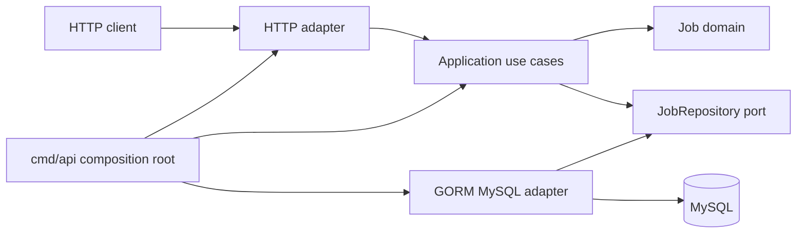

# Asynchronous Job Processing POC

A learning-focused asynchronous job-processing backend written in Go. The project demonstrates how an API can accept background jobs, persist their state, and evolve toward Redis-backed worker processing without coupling business rules to HTTP, MySQL, Redis, or GORM.

Days 1 and 2 are implemented. The API currently creates jobs in MySQL and reads their status. Redis is running as infrastructure, but queue publishing and workers intentionally begin on Day 3.

## Current features

- Clean Architecture package boundaries.
- Environment-based configuration with startup validation.
- Structured JSON logging using `log/slog`.
- HTTP server timeouts and graceful shutdown.
- Liveness and MySQL-backed readiness endpoints.
- MySQL and Redis services with health checks and persistent volumes.
- Versioned, reversible SQL migrations.
- GORM isolated inside the MySQL adapter.
- UUIDv4 job IDs and UTC timestamps.
- Create-job and get-job APIs.
- Consistent JSON error responses.
- Unit tests and an opt-in real-MySQL integration test.
- Multi-stage, non-root Docker image.

## Architecture



The dependency direction is inward:

```text
HTTP and GORM adapters → application ports/use cases → domain
```

The domain and application layers do not import GORM, MySQL, Redis, Docker, or HTTP packages.

## Project structure

```text
.
├── cmd/api/                         API composition root
├── internal/
│   ├── domain/job/                  Job entity, types, statuses, validation
│   ├── application/
│   │   ├── ports/                   Repository, ID generator, and clock contracts
│   │   └── usecase/                 CreateJob and GetJob
│   ├── adapters/
│   │   ├── http/                    Routes, handlers, request/response DTOs
│   │   └── mysql/                   GORM record, mapper, and repository
│   └── platform/                    Config, database, logging, IDs, clock, server
├── migrations/                      Versioned MySQL up/down migrations
├── Dockerfile
├── docker-compose.yml
├── Makefile
└── .env.example
```

## Prerequisites

- Go version declared in `go.mod`.
- Docker.
- Docker Compose. This machine uses the standalone `docker-compose` command.
- `curl` for API examples.

If your installation provides `docker compose` instead, run commands with:

```bash
make COMPOSE="docker compose" up
```

## Quick start

Create the local environment file:

```bash
cp .env.example .env
```

Change the example MySQL passwords in `.env`, then start the system:

```bash
make up
```

Check service health:

```bash
make ps
```

The API, MySQL, and Redis services should become healthy. MySQL can take several seconds during its first initialization.

Check the API:

```bash
curl -i http://localhost:8080/health/live
curl -i http://localhost:8080/health/ready
```

Expected bodies:

```json
{"status":"ok"}
```

```json
{"status":"ready"}
```

Stop the system without deleting data:

```bash
make down
```

## API

### Create a job

```http
POST /api/v1/jobs
Content-Type: application/json
```

Supported job types:

- `send_email`
- `report_generation`
- `data_cleanup`

Example:

```bash
curl -i -X POST http://localhost:8080/api/v1/jobs \
  -H "Content-Type: application/json" \
  -d '{
    "type": "send_email",
    "payload": {
      "to": "learner@example.com",
      "subject": "POC test"
    }
  }'
```

The API returns `202 Accepted`, a `Location` header, and the pending job:

```json
{
  "id": "150d8ee1-fcd6-4c4a-b8d0-693d5008a6ea",
  "type": "send_email",
  "status": "pending",
  "payload": {
    "to": "learner@example.com",
    "subject": "POC test"
  },
  "retry_count": 0,
  "max_retries": 3,
  "last_error": null,
  "created_at": "2026-08-03T10:30:10.794244Z",
  "updated_at": "2026-08-03T10:30:10.794244Z",
  "started_at": null,
  "completed_at": null
}
```

### Get a job

```bash
curl -i http://localhost:8080/api/v1/jobs/JOB_ID
```

An existing job returns `200 OK`. An absent valid UUID returns:

```json
{
  "error": {
    "code": "job_not_found",
    "message": "job was not found"
  }
}
```

### API error format

All expected API errors use:

```json
{
  "error": {
    "code": "validation_error",
    "message": "job type is not supported"
  }
}
```

Relevant status codes:

| Status | Meaning |
|---|---|
| `202` | Job accepted and persisted |
| `400` | Malformed request or domain validation failure |
| `404` | Job not found |
| `405` | HTTP method not supported for the route |
| `409` | Job ID already exists |
| `413` | Request body exceeds 1 MiB |
| `415` | Content type is not JSON |
| `500` | Unexpected internal failure |
| `503` | Required infrastructure is unavailable |

## Job model

| Field | Purpose |
|---|---|
| `id` | Public UUIDv4 identifier |
| `type` | Supported job operation |
| `status` | `pending`, `processing`, `success`, or `failed` |
| `payload` | Non-empty JSON object containing job input |
| `retry_count` | Number of retries already used |
| `max_retries` | Maximum retries after the first attempt; defaults to `3` |
| `last_error` | Last processing failure, when available |
| `created_at` | UTC creation time |
| `updated_at` | UTC last-update time |
| `started_at` | Processing start time |
| `completed_at` | Terminal completion time |

Three retries means one initial attempt plus up to three retry attempts, for a maximum of four attempts.

The intended lifecycle is:

```text
pending → processing → success
                     ↘ failed
```

Before the retry limit, a failed processing attempt will return to `pending`; worker transitions are introduced later.

## Database migrations

Migrations run automatically before the API starts.

Apply pending migrations manually:

```bash
make migrate-up
```

Show the current migration version:

```bash
make migrate-status
```

Roll back exactly one migration:

```bash
make migrate-down
```

Rolling back migration `000001_create_jobs` drops the `jobs` table and its data. Use rollback commands carefully.

GORM `AutoMigrate` is intentionally not used. Versioned SQL files provide explicit schema review and rollback behavior.

## Testing and checks

Run the unit test suite:

```bash
make test
```

Run formatting, tests, static analysis, and Compose validation:

```bash
make check
```

Run the real MySQL repository integration test while the MySQL container is running:

```bash
make test-integration
```

The integration test creates a unique job, verifies duplicate handling and lookup behavior, and removes its test row afterward.

Generate a coverage summary:

```bash
make test-cover
```

## Developer commands

Run `make help` to list all commands.

| Command | Purpose |
|---|---|
| `make up` | Build and start the complete stack |
| `make down` | Stop containers while preserving volumes |
| `make ps` | Display container and health status |
| `make logs` | Follow API, MySQL, and Redis logs |
| `make run` | Run Go locally against Docker MySQL and Redis |
| `make test` | Run unit tests |
| `make test-integration` | Run the real MySQL repository test |
| `make fmt` | Format Go code |
| `make vet` | Run Go static analysis |
| `make check` | Run the standard pre-commit checks |
| `make migrate-up` | Apply migrations |
| `make migrate-down` | Roll back one migration |
| `make migrate-status` | Show migration state |
| `make mysql` | Open a MySQL shell |
| `make redis` | Open a Redis CLI |

## Configuration

Configuration is read once at application startup and passed to outer-layer components.

| Variable | Description | Example |
|---|---|---|
| `APP_ENV` | Runtime environment | `development` |
| `LOG_LEVEL` | `debug`, `info`, `warn`, or `error` | `debug` |
| `HTTP_ADDRESS` | API bind address | `:8080` |
| `API_HOST_PORT` | API port exposed on the host | `8080` |
| `MYSQL_HOST` | MySQL hostname inside Docker | `mysql` |
| `MYSQL_PORT` | MySQL container port | `3306` |
| `MYSQL_HOST_PORT` | MySQL port exposed on the host | `3306` |
| `MYSQL_DATABASE` | Application database | `async_jobs` |
| `MYSQL_USER` | Application database user | `async_jobs_user` |
| `MYSQL_PASSWORD` | Application user password | Set locally |
| `MYSQL_ROOT_PASSWORD` | MySQL root password | Set locally |
| `REDIS_HOST` | Redis hostname inside Docker | `redis` |
| `REDIS_PORT` | Redis container port | `6379` |
| `REDIS_HOST_PORT` | Redis port exposed on the host | `6379` |
| `REDIS_PASSWORD` | Optional Redis password | Empty locally |

Never commit `.env`. Only `.env.example` belongs in version control.

## Troubleshooting

### MySQL says the root password is missing

Ensure `.env` contains `MYSQL_ROOT_PASSWORD`, then recreate the MySQL container so it receives the updated environment:

```bash
docker-compose up -d --force-recreate mysql
```

### Changing MySQL passwords has no effect

MySQL initialization variables are applied only to an empty data directory. Existing volumes retain their original users and passwords. Do not remove the volume unless you intentionally want to delete all local database data.

### A host port is already in use

Change `API_HOST_PORT`, `MYSQL_HOST_PORT`, or `REDIS_HOST_PORT` in `.env`. Container-side ports remain `8080`, `3306`, and `6379`.

### Jobs remain pending

That is expected at the end of Day 2. Redis queue publishing starts on Day 3, and worker processing follows on Days 4–5.

## Roadmap

- Day 3: publish job IDs to a Redis list.
- Day 4: consume queued jobs with one worker.
- Day 5: introduce a five-goroutine worker pool.
- Day 6: implement job-type-specific processing.
- Day 7: implement retry and final failure behavior.
- Day 8: expand lifecycle logging and status tracking.
- Day 9: add the minimal React UI.
- Day 10: polish integration tests, Docker, README, and demo flow.
